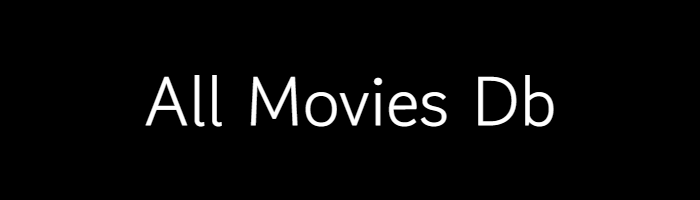

# AMDb 

### Browse, Search and Watchlist your favorite Movies and TV Shows    

### [Checkout Video Demo](https://youtu.be/JR2JwcJdGro)

### [Checkout AMDb](https://srky420.pythonanywhere.com/)

 

## Features

- Browse new, trending and popular movies and tv shows
- Access details like ratings, overviews, release dates and posters
- Watchlist movies and tv shows in realtime without page reload
- Get similar movie and tv show suggestions
- Access all seasons of tv shows with details of each episode
- Search titles with ease using auto suggestions
- Signup to add titles to your watchlist

 

## Installation

1. First download and install Python 3 [here](https://www.python.org/downloads/).

    Ensure Python 3 is installed,

        python --version

2. Install pip from [here](https://pip.pypa.io/en/stable/installation/) (Note: Make sure to add Python to environment variables).

    Ensure pip is installed,

        pip --version

3. Clone the project from GitHub repo [here](https://github.com/srky420/cs50-fp-bootstrap).

        git clone https://github.com/srky420/cs50-fp-bootstrap.git

4. Create virtual environment inside projects's directory and activate it,

        python -m venv venv

        .\venv\Scripts\activate

5. Install dependancies,

        pip install -r .\requirements.txt

 

## Usage

1. Be sure to signup at TMDb [here](https://www.themoviedb.org/) and get your free API KEY.

2. Create a .env file in project's directory with API_KEY,

        API_KEY=...

3. Run the app using,

        python app.py

 

## Implementation Details

### Configuring Flask App

- Creating templates folder to hold html templates and static folder to hold styling and scripting files.

- Flask app with the help of flask docs [here](https://flask.palletsprojects.com/en/2.2.x/quickstart/).

### Contacting API

- Retreiving API KEY from environment variable using,

        os.getenv("API_KEY")

- Creating an appropriate url for specific requests using TMDb instructions and API KEY [here](https://developers.themoviedb.org/3).

- Requesting the url using,

        url = f"https://.../{apikey}..."
        response = requests.get(url)

- Checking for errors using try-except.

- Parsing response using json().

        response = response.json()

### Creating Database Model

- Db configuration,

        app = Flask(__name__)
        app.config["SQLALCHEMY_DATABASE_URI"] = "sqlite:///project.db"
        db = SQLAlchemy(app)

- DB model is created using Python classes and Flask SQLAlchemy with the help of flask docs [here](https://flask-sqlalchemy.palletsprojects.com/en/3.0.x/).

        # Users table

        class Users(db.Model):
        id = db.Column(db.Integer, primary_key=True)
        username = db.Column(db.String(100), nullable=False)
        password = db.Column(db.String(200), nullable=False)

- Db is initialized using,

        db.create_all()

### Creating Routes

- Routes are created with the help of flask and view is created by render_template function for more see flask [docs](https://flask.palletsprojects.com/en/2.2.x/)

        # Example route

        from flask import render_template

        @app.route('/hello/<name>')
        def hello(name=None):
        return render_template('hello.html', name=name)

- Templates are located in template folder, each route renders a specific template.

### Creating JS Requests

- Realtime requests are made for search suggestions and watchlist add/remove buttons using JavaScript Fetch and Async Await function.
        
        /* For search suggestions */

        response = await fetch(<url>)
        result = await response.json()

        /* For add/remove buttons */

        var options = {
                method: 'POST',
                headers: {
                        'Content-Type': 
                        'appication/json'       
                }
        };
        fetch(<url>, options)
        .then((res) => res.json())
        .then((data) => console.log(data));
        
**Note**: Above code is just an example, see actual JS file for more details and Fetch API docs [here](https://developer.mozilla.org/en-US/docs/Web/API/Fetch_API/Using_Fetch).

### Creating User Authentication

**Session configuration**

        app.config["SESSION_PERMANENT"] = False
        app.config["SESSION_TYPE"] = "filesystem"
        Session(app)

**Signup**

- werkzeug.security is used to generate password hash and to check them, details [here](https://werkzeug.palletsprojects.com/en/2.2.x/utils/).

- User can only access signup page if not logged in.

- Username and password are stored in Db when a new user signs up with a unique username, a new object of Users class is created.

        user = Users(username, generate_password_hash(password))
        db.session.add(user)
        db.session.commit()

- User is redirected to index page with their user_id stored in flask session.

        session["user_id"] = user.id

**Note**: user represents an object of Users class which is created when user signs up.

**Login**

- User cannot access login page if they are already logged in.

- If not logged in, the login route first clears the session.

        session.clear()

- If username and password exists in Users table, new user_id is stored in flask session.

        user = Users.query.filter_by(username = username, password =      check_password_hash(password))

        session["user_id"] = user[0].id

**Logout**

- Logout simply clears the session and redirects.

        session.clear()
        return redirect("/")

**Note**: Errors are displayed using flask's messasge flashing docs [here](https://flask.palletsprojects.com/en/2.2.x/patterns/flashing/)

### Creating Watchlist

- Movies and Shows table are created seperately to distinguish between their actual API ids.

        class Movies(db.Model):
                id = db.Column(db.Integer, primary_key=True)
                movie_id = db.Column(db.Integer, nullable=False)
                watched = db.Column(db.Boolean, nullable=False, default=False)
                added_on = db.Column(db.Date, default=date.today())
                user_id = db.Column(db.Integer, db.ForeignKey("users.id"))

- Shows table is similar to Movies table.

- Once user is logged in, they can add/remove content from watchlist which creates new row in either movies or shows table based on route.

- Notice how above table has user_id as Foreign Key which helps determine which movies belong to which users and used to display appropriate add/remove buttons, similarly for Shows table as well.

### Creating Templates

- Movies and shows data are requested from API and displayed using HTML with Jinja2 syntax(i.e. for looping through lists, creating if statements and so on). More [here](https://flask.palletsprojects.com/en/2.2.x/templating/).

### Search and Pagination

- Search suggestions display search response from API, without reloading the page, using JS Fetch and Async Await function.

- Search results are shown within pages.

- Pagination is created using bootstrap and HTML plus Jinja2 syntax.

- Pagination always shows first and last pages with dots when at middle page.

- Pagination shows all the pages when number of pages is less than 5.

 

## Contact and Links

- [LinkedIn](http://www.linkedin.com/in/shahrukh-khan-2b8968242)

- [Facebook](https://www.facebook.com/profile.php?id=100083623483613&mibextid=ZbWKwL)

- [Youtube](https://www.youtube.com/channel/UCI2Kq5ukQKJ5roK_WL7TQsg)

- srky420@gmail.com

#

